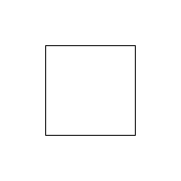
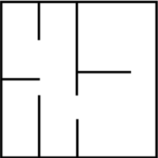
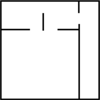
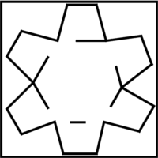
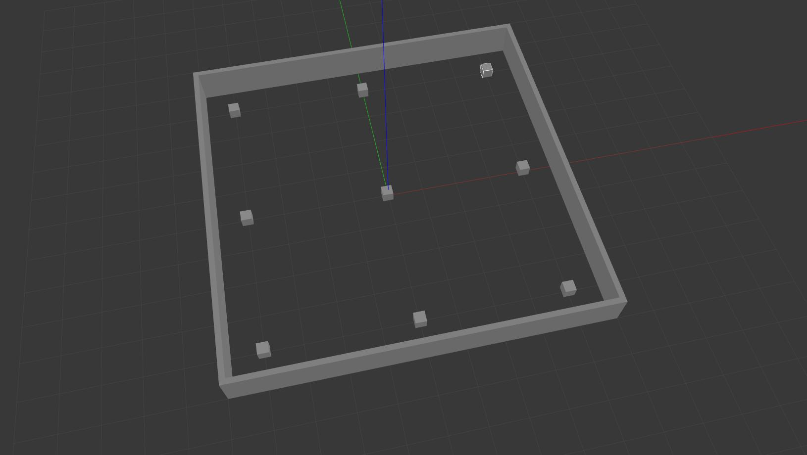
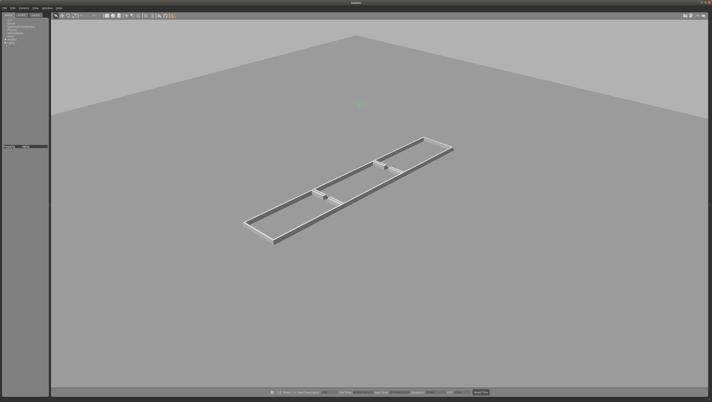
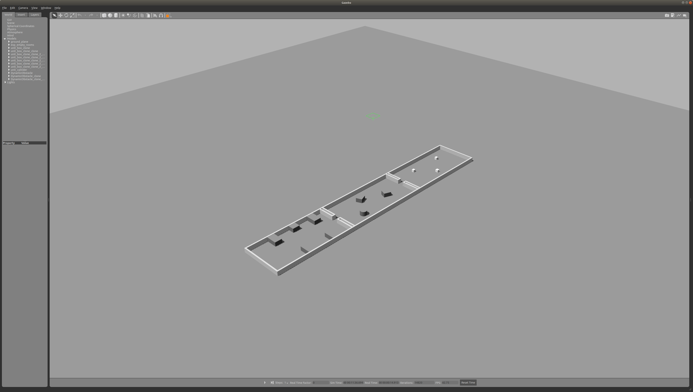
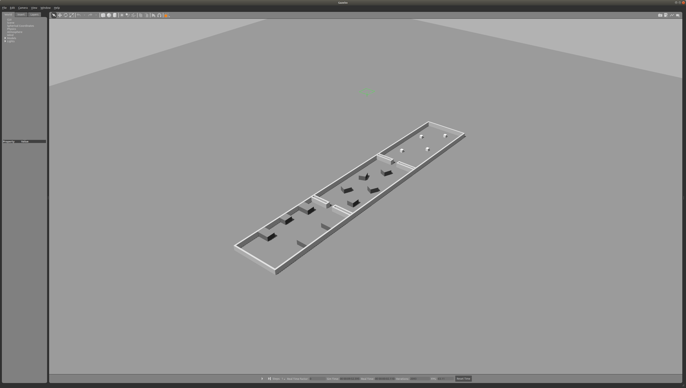
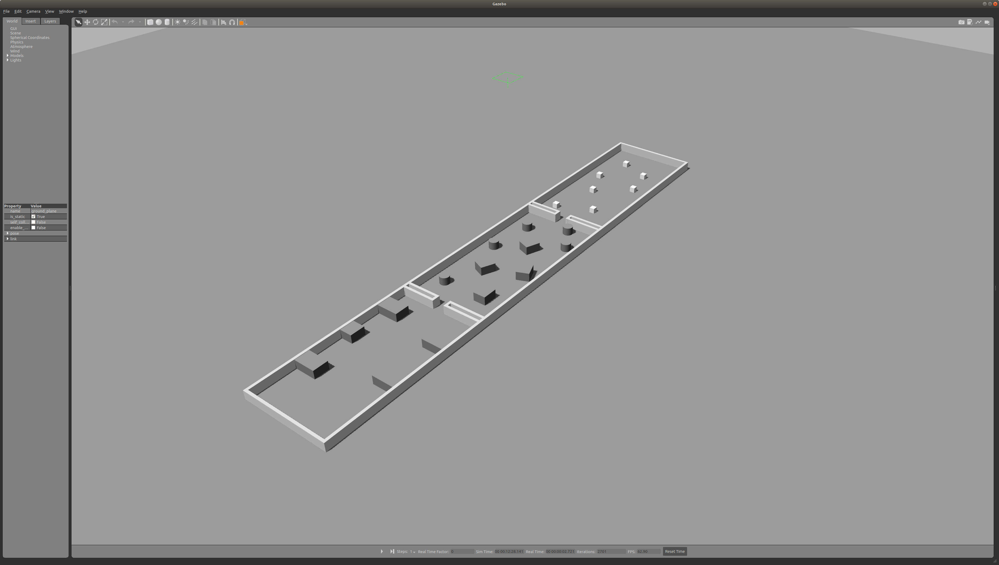
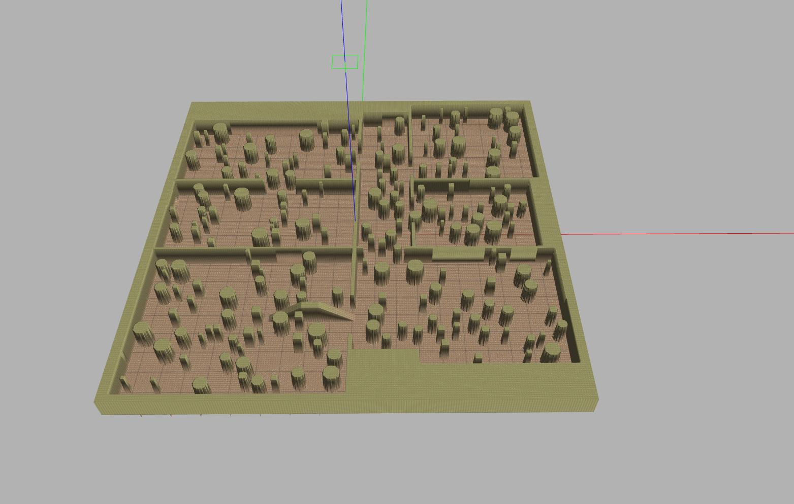

# Scuttle Gazebo

This repository contains a number of [Gazebo](http://gazebosim.org/) world definitions that can be used
for testing the [SCUTTLE robot](https://github.com/scuttlerobot) in a virtual world. It is assumed
that you have at least the following ROS packages:

* [scuttle_description](https://github.com/pvandervelde/scuttle_description) - Contains the geometric
  description of the SCUTTLE robot for ROS to work with.
* [scuttle_bringup](https://github.com/pvandervelde/scuttle_bringup) - Contains a launch file that will
  create all the ROS nodes required for SCUTTLE to function

## Worlds

The following world files are available in order of complexity.

### Empty Room

A room with 4 walls. Scuttle will be placed in the middle of the room. Started
by giving the following command:

    roslaunch scuttle_gazebo scuttle_empty_room.launch

### Room with walls 1

A set of 4 adjacent rooms with a corridor. Scuttle will be placed in the middle of the biggest room.
Started by giving the following command

    roslaunch scuttle_gazebo scuttle_room_with_walls_1.launch

### Room with walls 2

A set of 4 adjacent rooms with a corridor. Scuttle will be placed in the middle of the biggest
room. Started by giving the following command

    roslaunch scuttle_gazebo scuttle_room_with_walls_2.launch

### Star room with walls

A room in the shape of a star with some internal walls. Scuttle will be placed in the middle of
the room. Started by giving the following command:

    roslaunch scuttle_gazebo scuttle_star_room_with_walls.launch

### Dynamic room

A room with a number of moving objects. Started by giving the following command:

    roslaunch scuttle_gazebo scuttle_dynamic_room.launch

### Experiment room 1

A set of 3 adjacent rooms. Scuttle will be placed in one of the outer most room.
Started by giving the following command:

    roslaunch scuttle_gazebo scuttle_experiment_room_1.launch

### Experiment room 2

A set of 3 adjacent rooms similar to `experiment room 1` but with added obstacles.
Scuttle will be placed in one of the outer most room. Started by giving the following command:

    roslaunch scuttle_gazebo scuttle_experiment_room_2.launch

### Experiment room 3

A set of 3 adjacent rooms similar to `experiment room 2` but with more obstacles.
Scuttle will be placed in one of the outer most room. Started by giving the following command:

    roslaunch scuttle_gazebo scuttle_experiment_room_3.launch

### Experiment room 4

A set of 3 adjacent rooms similar to `experiment room 3` but with more obstacles.
Scuttle will be placed in one of the outer most room. Started by giving the following command:

    roslaunch scuttle_gazebo scuttle_experiment_room_4.launch

### Random room

A set of 6 adjacent rooms with a corridor. The rooms and the corridor are filled with obstacles
of different shape and size. Scuttle is placed in the middle of the corridor. Some of the gaps
between the obstacles are probably too small for scuttle to navigate. Started by giving the
following command:

    roslaunch scuttle_gazebo scuttle_random_room.launch

